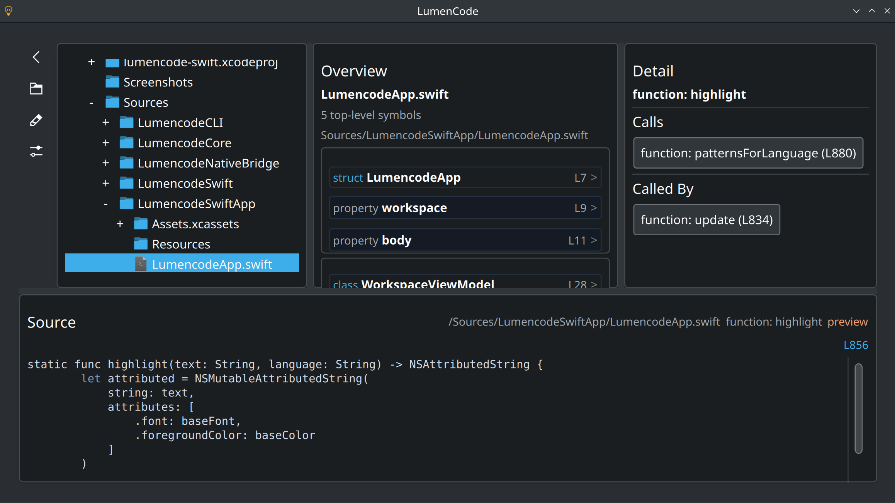

# LumenCode

LumenCode is a structural code explorer for local source trees. It focuses on code shape rather than freeform text editing. The application reads a filesystem tree, extracts symbols from supported source files, and lets the user drill from folders to files to symbols to member detail.

LumenCode is intentionally:

- filesystem-aware
- parser-assisted
- non-editing
- non-Git-aware



## Current State

What currently works:

- Browsing a project tree with a dense three-pane explorer and a resizable lower source pane.
- Resizing the top panes and lower source pane with draggable splitters.
- Opening files into overview/detail panes with a compact left control rail and project-root display as `/`.
- Preserving explorer scroll position across expand/collapse redraws and keeping child rows visibly indented.
- Using the left control rail for back navigation, open-in-folder, open-in-editor, and settings.
- Extracting detailed symbols for PHP, JS, TS, TSX, QML, CSS, HTML, JSON, Python, C/C++, Java, C#, Rust, and Objective-C.
- Extracting Swift symbols and members with a Tree-sitter-backed parser path.
- Using Tree-sitter for PHP, JS, TS, TSX, CSS, Python, Rust, Java, C#, and Swift parsing where integrated.
- Keeping the right detail pane permanently visible as a stable inspector surface.
- Showing a denser middle-pane overview with clickable top-level symbols and clickable nested member rows.
- Showing `Calls` and `Called By` sections in the right detail pane where relationship data is available.
- Resolving cross-file JS/TS/CommonJS relations more accurately, including aliased imports and destructured `require(...)` bindings.
- Showing syntax-colored lower-pane snippets with internal highlighting rather than an external highlighting dependency.
- Showing parser-aware diagnostics for supported snippet languages, while suppressing false errors for intentionally truncated previews.
- Showing file previews in the lower pane when a file itself is selected.
- Using an explicit snippet contract (`snippetKind`, `diagnosticsMode`) so preview excerpts are handled differently from standalone parseable code.
- Surfacing CSS class matches/misses from HTML and allowing those entries to drive the lower pane.
- Inspecting CSS classes directly from CSS files with rule-level snippets.
- Surfacing reciprocal web-asset relationships:
  - HTML files show linked scripts and stylesheets
  - CSS files show inbound HTML consumer pages plus matched/missing HTML class usage
  - local JS/TS-style script files show inbound HTML consumer pages when linked from `<script src=...>`
- Improved CommonJS and Node/service-style repo analysis, including:
  - dependency extraction from `require(...)` and `import`
  - export surfacing for `module.exports`, `exports.*`, and ES modules
  - basic Express route detection
  - related-file linking
  - `package.json` scripts, entrypoint, and dependency summaries
- A functional standalone CLI tool (`lumencode-cli`) for scripted analysis and regression checks.
- A crash-isolated file-analysis path: GUI selection now shells out to `lumencode-cli --dump-file`, so parser crashes terminate the helper instead of the main app.
- An asynchronous GUI analysis flow: file and cross-file symbol selection now analyze in the background instead of blocking the UI thread.
- CLI state now exposes the active lower-pane snippet payload, and interactive mode can select arbitrary source-context payloads for GUI-parity checks.
- A regression sweep harness at `tools/regression_sweep.py` that samples local projects, drives the CLI selection path, and validates snippet/diagnostic contracts across languages.
- A baseline fixture suite under `tests/fixtures/baseline/` with a manifest-driven set of small language-specific projects for deterministic regression coverage.
- The regression sweep now supports `--fixtures-only`, validates relation round-trips through the interactive selection path, and treats the fixture suite as the first stability gate before broader real-repo sweeps.
- Same-file `Calls` / `Called By` parity checks now cover Swift, PHP, JS/TS, Python, Rust, Java, and C# in the baseline fixture suite.
- Project-level summaries including file type counts and main entry-point detection.
- Installing a desktop launcher and scalable app icon through `cmake --install`.
- Stable-enough backend payloads for the current QML bindings.
- A self-contained repository layout for bundled parsers, so fresh clones no longer depend on broken gitlink/submodule state.
- Graceful failure paths for hostile inputs:
  - directory crawl limits for recursion depth, scanned nodes, and per-folder entries
  - parser-side large-file refusal with readable summaries
  - truncated file previews instead of unbounded lower-pane loads
  - bounded relationship augmentation with visible partial-analysis notices instead of silent degradation
  - explicit loading and warning states in the overview pane when analysis is still running or has been cut short

## Build

Typical local build:

```bash
cmake -S . -B build
cmake --build build
```

`build/` is now ignored by git and is no longer tracked in the repository.

If KF5 development packages are missing from the CMake search path, CMake will fail during configuration. That is an environment issue, not an application logic issue.

## Roadmap

Phase 1. Stabilization

- Remove remaining QML/runtime edge-case binding failures.
- Harden all selection payloads so every detail section is safe to bind.
- Reduce misleading or noisy structural output on real projects.
- Continue broad CLI-driven regression sweeps against mixed real-world projects under `/home/user/Code`.
- Keep growing the baseline fixture suite so each supported language or language-cluster has a small structural repro project checked into the repo.
- Continue AST-backed parity work language by language, using CLI-first verification before GUI iteration.
- Keep pragmatic heuristic coverage for valuable local languages such as QML where a dedicated grammar path is not yet integrated, instead of leaving them unsupported.
- Continue converting cross-file relationship work from name/snippet luck into explicit binding-aware or asset-aware models, especially for web projects.
- Treat surfaced analysis warnings as investigation leads, not just acceptable noise: some will indicate algorithmic or integration weaknesses rather than merely large inputs.

Phase 2. Better source inspection

- Improve snippet diagnostics beyond the current lightweight parser-aware checks.
- Continue improving context selection for dependencies, routes, and quick links in the lower pane.
- Support clearer line-focused navigation and open-in-editor behavior from overview/detail items into the lower pane.
- Rehabilitate the native Tree-sitter-backed parser paths language by language, using the new crash-isolated CLI flow and minimized repro files. Keep fallback and helper isolation in place until those native paths prove stable.
- Tighten relationship extraction so `Calls` and `Called By` behave consistently and reciprocally across supported languages.
- Add more genuinely useful inspector content for sparse symbol types, especially Swift functions, once the backend payloads are stable enough to trust.
- Keep replacing snippet-luck relation detection with proper AST walks where real projects prove the bounded-snippet fallback is too weak, as happened with Python docstring-heavy files.
- Decide what richer right-pane payload should exist for sparse Swift/function selections now that the pane is permanently present and relation/navigation data is becoming more reliable.

Phase 3. Better usability

- Search/filter across files and symbols.
- Improve visual hierarchy and information density further without sacrificing clarity.
- Continue refining the left global control rail and settings surface.

Phase 4. Broader project understanding

- Improve Node/CommonJS and service-repo structure understanding further.
- Refine HTML/CSS class analysis to reduce noisy matches/mismatches.
- Keep extending the reciprocal web-asset model deliberately rather than forcing HTML/CSS into fake call-graph semantics.
- Improve project-level summaries for package metadata, tests, and API artifacts.
- Continue refining entrypoint selection on broad multi-project roots.

## Known Issues

- Some extracted structure is still shallow or misleading on real projects.
- Some languages still rely on heuristic fallback paths for parts of the overview, especially when native parser paths have been bypassed for stability. Plain JS/JSX currently still use the heuristic parser path for stability, while TS/TSX remain Tree-sitter-backed.
- QML is now supported as a first-class language in the explorer and CLI, but it currently uses heuristic structural extraction rather than a dedicated AST-backed parser.
- `Calls` / `Called By` support has improved and relation clicks now rehydrate into full destination symbols, but the overall graph is still incomplete and not yet uniformly reciprocal across all languages and project shapes.
- The new overview warnings are part of the intended safety model. They mean the app stayed responsive and returned a bounded result, but they should still be treated as prompts to inspect why that bound was hit.
- Some project `mainEntry` guesses are still imperfect on broad mixed-language roots.
- HTML/CSS class comparison can still be noisy on complex HTML documents.
- Reciprocal web-asset links are now intentional product behavior, but they currently only scan nearby HTML files and do not yet model broader templating or multi-root asset pipelines.
- Syntax highlighting is currently an internal lightweight implementation, not a full external highlighter.
- Snippet diagnostics are intentionally conservative for truncated previews and are not a full linter.
- The UI is materially improved and the current pane layout should be treated as the baseline, but still needs a stabilization and polish pass.

Licensing note:

- Vendored parser sources and their retained upstream license files are documented in `THIRD_PARTY_NOTICES.md`
