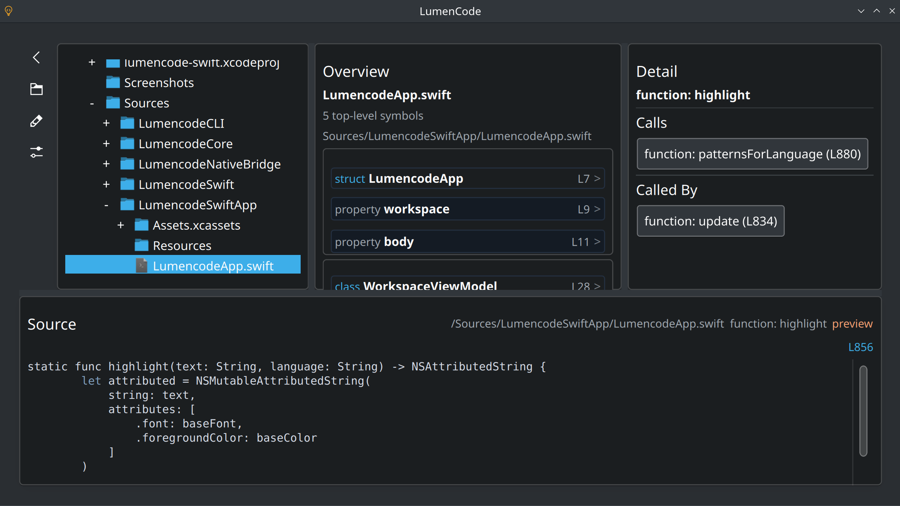

# LumenCode

LumenCode is a structural code explorer for local source trees. It focuses on code shape rather than freeform text editing. The application reads a filesystem tree, extracts symbols from supported source files, and lets the user drill from folders to files to symbols to member detail.

LumenCode is intentionally:

- filesystem-aware
- parser-assisted
- non-editing
- non-Git-aware



## Guides

- [Docs Index](docs/README.md)
- [End-User Guide](docs/end-user-guide.md)
- [Developer Guide](docs/developer-guide.md)

## Current State

_Last updated: 2026-09-29._

LumenCode is a working desktop explorer (Qt 5.15 / KF5 Kirigami) with a
backend that is now developed and regression-tested almost entirely through
its command-line twin, `lumencode-cli`. The current milestone is still
**stabilization and trustworthiness of the inspection pipeline, before
search**. See [Recent History](#recent-history) for how it got here and
[`docs/implementation-log.md`](docs/implementation-log.md) for the detail.

### The product

- A dense three-pane explorer (tree / overview / permanent detail inspector)
  with a resizable lower source pane, draggable splitters, and a left control
  rail (back, open-in-folder, open-in-editor, settings).
- Drill-down from folders to files to symbols to members, with `Calls` /
  `Called By`, `Parameters` / `Returns`, dependencies, routes and quick links
  in the inspector. Every entry drives the lower pane, including entries that
  point into another file.
- Syntax-coloured snippets with conservative, parser-aware diagnostics
  (truncated previews never produce false errors).
- Project summaries (file-type counts, main entry point) and `package.json`
  summaries.
- Crash isolation and responsiveness: the GUI analyses each file by running
  `lumencode-cli --dump-file` in the background, so a parser crash only kills
  the helper. Directory crawls, file sizes and cross-file relationship scans
  are bounded, and hitting a bound shows a visible notice instead of hanging.
  Minified or bundled assets are skipped deliberately.

### The analysis engine, per language

| Language | Parser | Syntax errors | Structure | Calls / Called By | Dependencies | Routes | Signatures |
|---|---|---|---|---|---|---|---|
| PHP | Tree-sitter | repair → heuristic | classes, functions, members | same-file, callbacks | `use` (resolved via composer PSR-4), `require`/`include` | Slim / Lumen, Laravel, CodeIgniter | **from the syntax tree** (types, defaults, variadics, promoted properties; declared or inferred returns) |
| JavaScript / JSX | Tree-sitter (heuristic fallback) | repair → heuristic | declarations, IIFE/UMD/AMD bodies, `X.prototype.m`, closure modules, `X.extend({...})` classes | same-file and cross-file (imports, `require` bindings) | `import`, `require` | Express (anywhere in the tree) | **from the syntax tree** (defaults, rest/destructuring; return paths inferred, `Promise<…>` for async) |
| TypeScript / TSX | Tree-sitter | repair → heuristic | as JS, plus interfaces and types | as JS | as JS | as JS | **from the syntax tree** (annotations, optional `?`, defaults, accessibility; declared return types) |
| Python | Tree-sitter | repair (indented blocks) → heuristic | classes, functions, methods, properties | AST walk | imports | Flask / FastAPI | **from the syntax tree**: parameters with types/defaults, annotated or inferred returns per return path |
| Java | Tree-sitter | repair → heuristic | types, members | yes | imports | Spring (`@RequestMapping`, `@GetMapping`, ...), JAX-RS (`@Path` + verbs) | **from the syntax tree** |
| C# | Tree-sitter | repair → heuristic | types, members, top-level programs | yes | `using` | ASP.NET attributes / minimal APIs | **from the syntax tree** (`ref`/`out`/`params`/`this`, defaults, generics) |
| Rust | Tree-sitter | repair → heuristic | items, impls, modules | yes | `use` | — | snippet-derived |
| Swift | Tree-sitter | repair | types, extensions, members | yes | `import` / `@testable import` | — | snippet-derived |
| Go | Tree-sitter | repair | structs (fields), interfaces (methods, embeds), types/aliases, functions, receiver methods grouped under their type, consts/vars | yes | imports (incl. aliases) | net/http (`HandleFunc`, Go 1.22 `"GET /x"` patterns), gin, chi, echo | **from the syntax tree** (grouped params, variadics, multiple results) |
| CSS | Tree-sitter | repair → heuristic | rules, custom properties | — | `@import`, `url()` | — | — |
| HTML | tree-sitter-html | tolerant grammar | ids, event handlers, custom elements, forms, inline `<script>` / `<style>` contents | handlers → JS functions | linked assets | — | — |
| QML | heuristic | — | components, properties, signals, functions, signal handlers | functions ↔ handlers (from handler blocks) | imports | — | snippet-derived |
| C / C++ | Tree-sitter (C++ grammar, used for C too; heuristic fallback) | repair → heuristic; macro-noisy files (>25 initial errors) go straight to the merge | namespaces, classes/structs/unions (access levels, bases, fields, methods, ctors/dtors, function-pointer fields), out-of-line `A::f` definitions grouped by scope, enums, typedefs, prototypes | yes | `#include` (resolved for local headers) | — | **from the syntax tree** (qualifiers, pointers/references, defaults) |
| Objective-C | heuristic | — | classes, members | — (gap) | `#import` | — | snippet-derived |
| VB.NET | structural line parser (block-aware) | unterminated blocks closed at the next declaration, reported | namespaces, classes, modules, structures, interfaces, enums, members, fields, events | yes (incl. `RaiseEvent`) | `Imports` (incl. aliases) | ASP.NET attributes (`<Route>`, `<HttpGet>`, ...) | **exact** from declarations (`ByVal x As T`, `Optional ... = v`, `As T`) |
| SQL (MySQL / MariaDB, SQL Server T-SQL) | statement-aware parser | objects end at the next `CREATE`/`ALTER`, `GO` or `DELIMITER`; strings cannot cross batches | tables (columns, keys), views, procedures, functions, triggers, indexes | table → table *references* (FKs); views/routines/triggers *read* / *write* tables; routines *execute* / *call* routines; triggers *fire on* tables | `USE`, `source` / `\.` / `:r` scripts | — | from declarations (`IN`/`OUT`/`@p ... OUTPUT`, defaults, `RETURNS`) |
| JSON | — | — | `package.json` scripts, entry, dependencies | — | — | — | — |

"repair → heuristic" is the parser authority model:

1. A clean syntax tree is authoritative.
2. If the tree has errors, a **branch-scoped repair** pass finds the lines the
   parser flags, blanks them (offsets and line numbers unchanged) and
   re-parses, keeping the damage local to those lines instead of losing the
   rest of the class or file.
3. Declarations that start on a blanked line (e.g. a half-typed `def` header)
   are recovered by the heuristic parser.
4. Only if the tree is still broken does the heuristic parser supplement it,
   and then only in ranges the tree does not cover.

Every payload says which of these happened (`analysisSourceMode`:
`ast` / `recovered` / `heuristic`, `analysisConfidence`,
`analysisDamagedLines`, per-symbol `sourceMode` / `confidence`).

### Cross-language links (web)

HTML, CSS and JavaScript are analysed as one linked model rather than three
separate files:

- **JS → HTML / CSS**: `getElementById`, `querySelector(All)`, `$('#x')`,
  `classList.*`, jQuery class methods, `className =` and
  `setAttribute('class', ...)` are resolved to the element or CSS rule they
  touch, and flagged when they resolve nowhere (e.g. `#footer — no such
  element in index.html`). Functions called from HTML `on*` handlers get
  `Called By` edges back to the handler. Custom elements registered with
  `customElements.define` link to the pages that use them.
- **HTML → JS / CSS**: handlers have `Calls` into inline or linked-script
  functions; ids list the scripts that use them; class usage is matched
  against linked, inline and sibling stylesheets.
- **CSS → HTML / JS**: consumer pages; classes applied only from JavaScript
  are recognised (`scriptAppliedClasses`) so they are not reported as
  unused; `unusedClasses` lists the rest.
- Consumer pages are found in the asset's folder or the nearest ancestor
  folder that links it. PHP templates count as pages, and PHP files that
  render HTML get the same asset links.

### Backend development without the GUI

The backend is iterated through the CLI. The GUI is only needed for purely
visual work.

```bash
cmake -S . -B build && cmake --build build --target lumencode-cli
./build/bin/lumencode-cli --dump-file path/to/file      # one file's analysis JSON (what the GUI shows)
./build/bin/lumencode-cli --debug-ast path/to/file      # Tree-sitter error nodes + repair outcome
./build/bin/lumencode-cli -i                            # scripted selection session (JSON commands on stdin)

python3 tools/regression_sweep.py --fixtures-only       # first gate: 33 fixture cases, relation round-trips
python3 tools/fetch_corpus.py                           # pinned public corpus (27 repos, ~6.4k files)
python3 tools/corpus_scan.py --save before.json         # whole-corpus coverage / timing / contract scan
python3 tools/corpus_scan.py --compare before.json      # ... then diff after a change
python3 tools/damage_probe.py                           # how far an injected syntax error spreads
python3 tools/regression_sweep.py --corpus-root ~/.cache/lumencode-corpus --max-files 300
```

- **Fixtures:** `tests/fixtures/baseline/` holds small projects per language
  cluster. They include broken-code recovery cases, Python return paths, a
  web app (HTML at the root, `css/` and `js/` below) and a composer/Slim PHP
  app. `manifest.json` asserts symbols, relations, signatures, provenance,
  quick-link labels and CSS usage.
- **Corpus:** `tools/corpus.json` pins 27 public repositories by commit
  (web, JS/TS, Python, PHP, Java, C#, VB.NET, Rust, Swift, Go, C/C++, Ruby,
  Kotlin, Bash, SQL, QML, Objective-C), so sweeps work on any machine or in
  a cloud container. `$LUMENCODE_CORPUS` points the tools at it.
- **Damage probe:** injects a garbage line, an unclosed call or an unclosed
  string into one function of a clean file, and measures how many *other*
  declarations survive. It is currently 97% overall across 852 probes
  (JavaScript 98.5%).

## Build

Typical local build:

```bash
cmake -S . -B build
cmake --build build
```

`build/` is now ignored by git and is no longer tracked in the repository.

If KF5 development packages are missing from the CMake search path, CMake will fail during configuration. That is an environment issue, not an application logic issue.

On Ubuntu 24.04 / Kubuntu the build dependencies are:

```bash
sudo apt install cmake g++ extra-cmake-modules qtbase5-dev qtdeclarative5-dev \
    qtquickcontrols2-5-dev kirigami2-dev libkf5coreaddons-dev
```

For backend work only the CLI target is needed:
`cmake --build build --target lumencode-cli`.

## Recent History

- **2026-03 — bootstrap.** Qt/Kirigami explorer, heuristic parsers for the
  main languages, `lumencode-cli` with one-shot and interactive modes, lower
  source pane with internal highlighting.
- **2026-04 — AST and relations.** Tree-sitter for PHP, TS/TSX, CSS, Python,
  Rust, Java, C# and Swift, with vendored grammars so fresh clones build.
  `Calls` / `Called By` with rehydration of relation clicks. Crash-isolated
  helper process and asynchronous GUI analysis.
- **2026-06 — trust.** Checked-in fixture suite and corpus sweep. Provenance
  and confidence on every payload. Parser-owned callable signatures. The
  deliberate `recovered` mode for broken files (a first parser-wide
  error-node walker was backed out as unstable). CSS/HTML noise reduction and
  a single-pass CSS class index.
- **2026-09 — breadth and resilience** (branch `claude/cool-dijkstra-1pnw8f`):
  - a pinned public corpus, a whole-corpus scanner and the damage probe, so
    work no longer depends on a private `~/Code` tree (these found and fixed
    a null-node crash in the TS parser)
  - branch-scoped AST repair for every Tree-sitter language, with Swift and
    CSS brought into recovery; damage-probe retention went from 91% to 97%
  - plain JS/JSX moved onto the Tree-sitter path, with real-world JS shapes
    (wrappers, prototypes, closure modules, class factories, nested routes)
  - Python signatures from the syntax tree, with return types described
    across all return paths
    ([issue #1](https://github.com/macsplit/lumencode/issues/1))
  - the HTML ↔ CSS ↔ JS link model on tree-sitter-html; HTML files went from
    no symbols to 78% of corpus pages with structure
  - PHP dependencies (PSR-4-resolved `use`, `require`/`include`), framework
    routes and template asset links (previously none)

## Roadmap
Next major milestone: stabilization and trustworthiness of the inspection pipeline, before search.

Phase 1. Stabilization

- Remove remaining QML/runtime edge-case binding failures.
- Harden all selection payloads so every detail section is safe to bind.
- Reduce misleading or noisy structural output on real projects.
- Continue broad CLI-driven regression sweeps: the pinned public corpus (`tools/corpus.json`) plus local projects under `/home/user/Code`.
- Keep growing the baseline fixture suite so each supported language or language-cluster has a small structural repro project checked into the repo.
- Continue AST-backed parity work language by language, using CLI-first verification before GUI iteration.
- ~~Continue the authority/recovery refactor language by language~~ **Done (2026-09):** every Tree-sitter language now goes through one AST-first path with branch-scoped repair; keep driving the damage-probe retention up (worst remaining: Swift and Java unclosed strings).
- Keep tightening the current range-aware recovery model language by language, using fixture-gated refinements rather than broad parser-wide error walkers.
- Move callable signature extraction from parser-layer snippet heuristics to grammar-specific AST fields language by language. **Done (2026-09) for Python (issue #1), TS/JS, PHP, Java, C#, Go and C/C++**; Rust and Swift next.
- Keep pragmatic heuristic coverage for valuable local languages such as QML where a dedicated grammar path is not yet integrated, instead of leaving them unsupported.
- Continue converting cross-file relationship work from name/snippet luck into explicit binding-aware or asset-aware models. **Web (HTML/CSS/JS) and PHP (`use` via PSR-4) done (2026-09)**; next: calls into `use`-resolved PHP classes, JS `fetch()` / `axios` calls to backend routes (Express, Flask, PHP), Python package imports.
- Treat surfaced analysis warnings as investigation leads, not just acceptable noise: some will indicate algorithmic or integration weaknesses rather than merely large inputs.

Phase 2. Better source inspection

- Improve snippet diagnostics beyond the current lightweight parser-aware checks.
- Continue improving context selection for dependencies, routes, and quick links in the lower pane.
- Support clearer line-focused navigation and open-in-editor behavior from overview/detail items into the lower pane.
- Rehabilitate the native Tree-sitter-backed parser paths language by language, using the crash-isolated CLI flow and minimized repro files. **Plain JS/JSX done (2026-09)** after the corpus scan found and fixed the underlying crash. Keep fallback and helper isolation in place.
- Tighten relationship extraction so `Calls` and `Called By` behave consistently and reciprocally across supported languages.
- Add more genuinely useful inspector content for sparse symbol types, especially Swift functions, once the backend payloads are stable enough to trust.
- Keep replacing snippet-luck relation detection with proper AST walks where real projects prove the bounded-snippet fallback is too weak, as happened with Python docstring-heavy files.
- Decide what richer right-pane payload should exist for sparse Swift/function selections now that the pane is permanently present and relation/navigation data is becoming more reliable.

Phase 2b. Language breadth and link parity

- Add new languages seen in the corpus: Kotlin, Ruby and Bash. (Go and AST-backed C/C++ done 2026-09.) (VB.NET and SQL done 2026-09 with structural parsers.)
- Close per-language link gaps: ~~Swift imports, Java (Spring / JAX-RS) routes~~ (done 2026-09), Objective-C call relations. (QML done 2026-09.)
- Use `tools/corpus_scan.py --compare` and `tools/damage_probe.py` as the acceptance gates for each language.

Phase 3. Better usability

- Search/filter across files and symbols.
- Improve visual hierarchy and information density further without sacrificing clarity.
- Continue refining the left global control rail and settings surface.

Phase 4. Broader project understanding

- Improve Node/CommonJS and service-repo structure understanding further.
- Refine HTML/CSS class analysis to reduce noisy matches/mismatches. (2026-09: rebuilt on tree-sitter-html; compound selectors such as `li.completed` fixed.)
- Keep extending the reciprocal web-asset model deliberately rather than forcing HTML/CSS into fake call-graph semantics. The only call-style edges are HTML event handlers → JS functions.
- Improve project-level summaries for package metadata, tests, and API artifacts.
- Continue refining entrypoint selection on broad multi-project roots.

## Known Issues

- Some extracted structure is still shallow or misleading on real projects.
- QML and Objective-C still use heuristic parsers only; VB.NET and SQL use purpose-built structural parsers. All other supported languages (now including plain JS/JSX, C/C++ and Go) are Tree-sitter-backed with a fallback.
- C/C++ that relies heavily on unexpanded macros (export/visibility macros, Qt's `Q_OBJECT` etc.) trips the grammar in about two thirds of corpus files; those files are analysed as AST + heuristic merge and can show some macro-shaped noise symbols.
- Recovery is AST-first for every Tree-sitter language (including Swift and CSS) via branch-scoped repair. A missing closing brace cannot be fixed by blanking lines, so such files still fall back to the AST+heuristic merge. Repair is bounded (80 trial parses), so very large files with grammar gaps (e.g. some valid Swift) may stop repairing early.
- About 19% of valid Swift files in the corpus trip grammar gaps and go through repair. That costs time (Swift p95 is the highest of the languages) but not declarations: a repair is rejected if it would lose any.
- Callable signatures come from the syntax tree (or, for VB.NET and SQL, from the declarations) everywhere except Rust, Swift, QML and Objective-C, which still use snippet heuristics.
- QML is now supported as a first-class language in the explorer and CLI, but it currently uses heuristic structural extraction rather than a dedicated AST-backed parser.
- `Calls` / `Called By` support has improved and relation clicks now rehydrate into full destination symbols, but the overall graph is still incomplete and not yet uniformly reciprocal across all languages and project shapes.
- The new overview warnings are part of the intended safety model. They mean the app stayed responsive and returned a bounded result, but they should still be treated as prompts to inspect why that bound was hit.
- Some script or stylesheet files are now intentionally skipped as probable minified/bundled assets; that is deliberate product behavior, not a parser failure.
- Some project `mainEntry` guesses are still imperfect on broad mixed-language roots.
- HTML/CSS class comparison can still be noisy on complex HTML documents.
- Web links find consumer pages in the asset's folder or the nearest ancestor folder that links it (up to three levels). Bundler pipelines (webpack/Vite entry points), server-side templates other than PHP, and assets under `node_modules` are not modelled.
- Syntax highlighting is currently an internal lightweight implementation, not a full external highlighter.
- Snippet diagnostics are intentionally conservative for truncated previews and are not a full linter.
- The UI is materially improved and the current pane layout should be treated as the baseline, but still needs a stabilization and polish pass.

Licensing note:

- Vendored parser sources and their retained upstream license files are documented in `THIRD_PARTY_NOTICES.md`
