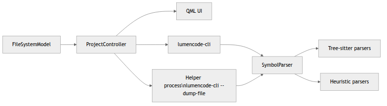
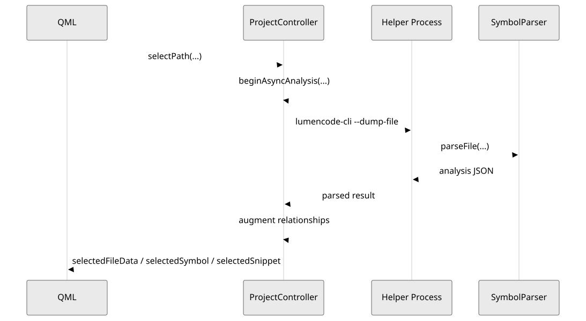
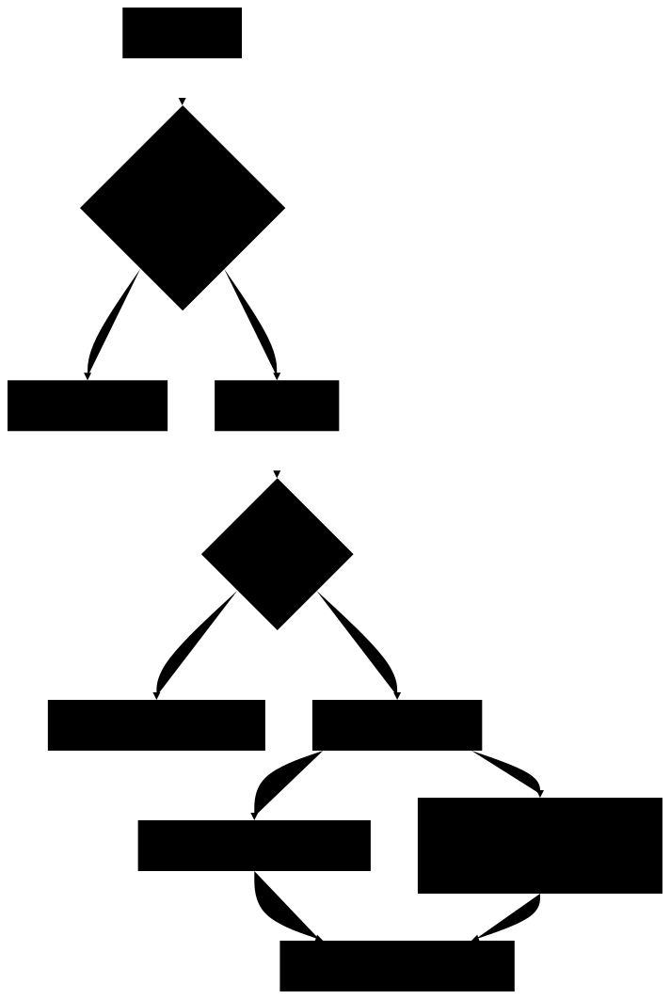
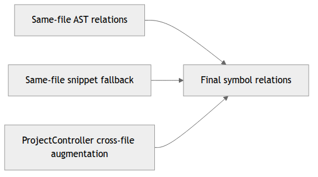
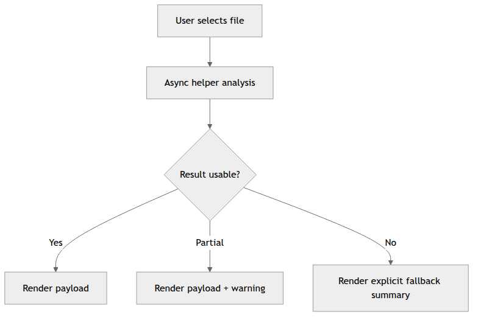
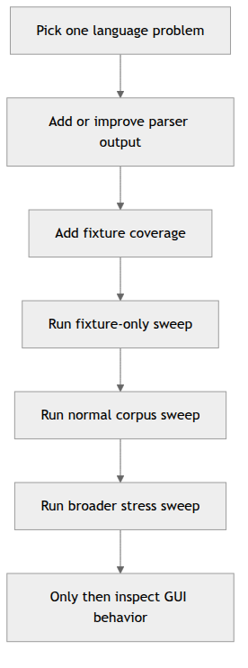

# LumenCode Developer Guide

This guide explains how LumenCode is structured, how data moves through the system, and how to work on it without destabilizing the product.

The project goal is not “parse everything perfectly.” The goal is “stay responsive, produce useful structural output, and degrade visibly rather than flakily.”

## System Overview



Source: [developer-system-overview.mmd](./diagrams/developer-system-overview.mmd)

## Core Runtime Flow



Source: [developer-runtime-flow.mmd](./diagrams/developer-runtime-flow.mmd)

## Main Components

### `FileSystemModel`

- Owns the visible project tree.
- Applies crawl limits.
- Filters supported source types.

### `ProjectController`

- Owns selected path, selected file payload, selected symbol, and lower-pane snippet state.
- Runs file analysis asynchronously.
- Rehydrates relation clicks into actual symbols.
- Adds bounded project-level relationship augmentation.

### `SymbolParser`

- Produces file analysis payloads.
- Uses Tree-sitter where supported.
- Uses heuristics where Tree-sitter is unavailable or intentionally avoided.
- Owns symbol signatures, provenance, and recovered-analysis behavior.

### `lumencode-cli`

- Exposes the same backend contract as the GUI path.
- Used for crash isolation.
- Used for fixtures and real-repo sweeps.

## Parsing Authority Model



Source: [developer-authority-model.mmd](./diagrams/developer-authority-model.mmd)

This is the current stable recovery contract. Earlier generic error-node harvesting was backed out because it was not stable enough across grammars.

## Data Contract

The important backend payloads are:

- file analysis
- symbol tree
- relation entries
- source-context items for lower-pane navigation

Important file-level fields:

- `symbols`
- `dependencies`
- `routes`
- `quickLinks`
- `relatedFiles`
- `summary`
- `analysisSourceMode`
- `analysisConfidence`
- `analysisHasAstErrors`
- `analysisPartial`
- `analysisNotices`

Important symbol-level fields:

- `kind`
- `name`
- `line`
- `detail`
- `snippet`
- `members`
- `calls`
- `calledBy`
- `parameters`
- `returns`
- `sourceMode`
- `confidence`

## Selection and Rehydration Model


Source: [developer-selection-rehydration.mmd](./diagrams/developer-selection-rehydration.mmd)

Important rule: thin relation payloads should never remain the final selected state when a real symbol can be hydrated from the current file payload.

## Relationship Layers



Source: [developer-relationship-layers.mmd](./diagrams/developer-relationship-layers.mmd)

Guidance:

- prefer AST walks first
- keep snippet fallback supplemental
- budget cross-file augmentation aggressively
- gate low-value expensive work

## Robustness Model



Source: [developer-robustness-model.mmd](./diagrams/developer-robustness-model.mmd)

Current robustness interventions include:

- helper-process crash isolation
- async analysis
- large-file refusal
- minified/bundled asset skipping
- bounded relationship augmentation
- explicit loading and warning states
- recovered-analysis provenance

## How To Add Or Improve A Language



Source: [developer-language-workflow.mmd](./diagrams/developer-language-workflow.mmd)

Rules:

- avoid broad parser-wide changes when a language-specific step will do
- keep the CLI as the main regression loop
- prefer improving payload quality before touching UI presentation

## Regression Strategy

There are three useful lanes:

```bash
python3 tools/regression_sweep.py --fixtures-only
python3 tools/regression_sweep.py --max-files 24 --limit-per-project 3
python3 tools/regression_sweep.py --max-files 80 --limit-per-project 4
```

Use them in that order.

## What Not To Do

- Do not treat warnings as harmless by default.
- Do not add expensive controller work without a clear budget.
- Do not let heuristics compete with AST output across the whole file.
- Do not rely on GUI behavior as the first signal of parser correctness.

## Current Architectural Boundaries

- Swift is AST-backed but still not as rich in inspector payload as desired.
- QML remains heuristic.
- Signature extraction is backend-owned, but not every language uses grammar-node extraction yet.
- Cross-file relations are materially better, but still not uniformly complete across all languages and repos.
