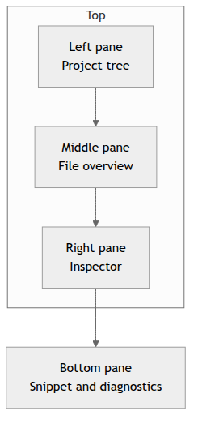
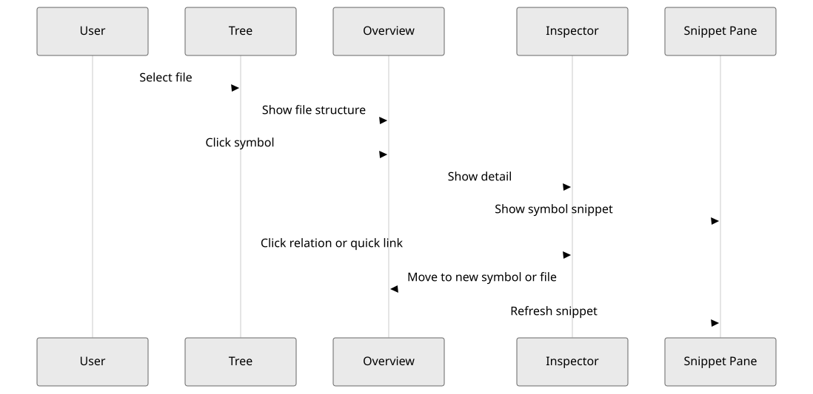
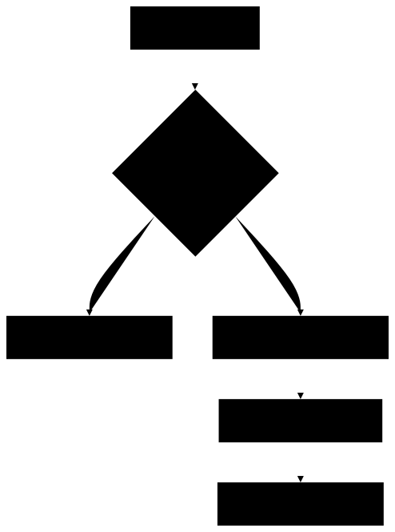

# LumenCode End-User Guide

LumenCode is a structural code explorer. It is designed to help you understand how a codebase is organized, what a file exposes, and how symbols relate to each other.

It is not a text editor and it is not a Git client. The product value is fast structural inspection.

## Mental Model


Source: [end-user-mental-model.mmd](./diagrams/end-user-mental-model.mmd)

## Main Screen



Source: [end-user-main-screen.mmd](./diagrams/end-user-main-screen.mmd)

### Left Pane

- Shows the project tree.
- Lets you move through folders and files.
- Uses `/` as the visible project root.
- The search box above the tree (Ctrl+F) finds symbols and files by name once the project index is ready. Partial names, camelCase initials (`spp` finds `SymbolParser.parseFile`) and rough spellings work; the Files / Functions / Types buttons narrow the results. Enter opens the best match, clicking any result opens it and unfolds the tree to its file. Esc clears the search.

### Middle Pane

- Shows the structural overview of the selected file.
- Top-level symbols are clickable blocks.
- Nested members are individually clickable rows.

### Right Pane

- Always visible.
- Shows the current symbol’s detail.
- Typical sections include members, `Calls`, `Called By`, `Parameters`, `Returns`, quick links, dependencies, CSS summaries, and related files.

### Bottom Pane

- Shows the current snippet.
- For files: preview text.
- For symbols and related items: focused excerpts.
- Diagnostics appear when the snippet is meant to be parseable.

## Typical Workflow



Source: [end-user-typical-workflow.mmd](./diagrams/end-user-typical-workflow.mmd)

## What To Expect In Different File Types

### Code files

- Functions, methods, classes, structs, interfaces, traits, modules, properties, and constants may appear.
- Some languages also expose routes, imports, exports, and related files.

### Web files

- HTML can expose linked scripts and stylesheets.
- CSS can expose classes and linked HTML consumers.
- JS/TS can expose cross-file calls and inbound HTML consumers.

### Package and API metadata

- `package.json` can expose scripts, entrypoints, and dependencies.
- OpenAPI-style JSON can expose route summaries.

## Understanding Warnings

Warnings are part of normal bounded behavior, not necessarily a failure.



Source: [end-user-warnings.mmd](./diagrams/end-user-warnings.mmd)

Common reasons:

- very large file
- minified or bundled asset
- expensive cross-file relationship work
- broken source where only partial structure is safe to show

How degraded data looks:

- Orange entries with a warning icon are links that resolve nowhere: a missing stylesheet, script or form target, an unresolved import, a class used in HTML but defined in no stylesheet.
- A warning mark before a symbol means it sits on a syntax error LumenCode repaired around (red) or was recovered with lower confidence (amber); hover it for the reason. Treat its members as approximate.
- When the source pane shows a snippet that contains repaired lines, a red note above it names them.
- In SQL files, relations say what they are: `reads`, `writes`, `references`, `executes`, `fires on`, `indexes` (and the reverse, `read by` ...).

## Known Product Boundaries

- Some languages are deeper than others.
- Cross-file call graphs are useful but not universally complete.
- QML support is useful but still heuristic.
- Swift symbol extraction exists, but some Swift inspector views are still sparser than ideal.

## Practical Tips

- Start from a narrow project root when you want faster, cleaner relation data.
- Use the middle pane to pick the right symbol before relying on the right pane.
- Treat warnings as “bounded result returned” rather than “application broke”.
- Use the CLI when you want repeatable inspection or regression-style checks.

## CLI Use

```bash
./build/bin/lumencode-cli --dump-file /path/to/file
```

```bash
./build/bin/lumencode-cli -i
```

The CLI is useful when you want the same backend payloads without the GUI.
